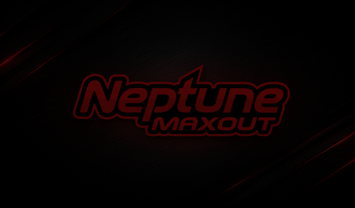

# Neptune Maxout KlipperScreen theme

The Neptune Maxout theme gives the Pad 7 a project-specific visual identity without changing any printer behavior. It supports both the stock CB1 Pad 7 and a Pad 7 upgraded to CM4.



## Visual design

- Charcoal and near-black background derived from the official project artwork
- Performance-red active controls, focus rings, sliders, and temperature traces
- High-contrast white text for the 1024 x 600 Pad 7
- Darkened background artwork so buttons and warnings remain readable
- Neptune Maxout printer badge for KlipperScreen printer selection
- Compatible landscape and portrait layouts
- Original short retro toy-laser feedback for KlipperScreen buttons

The theme changes KlipperScreen CSS, images, the selected theme name, and its UI sound hook. On CM4 it also enables the Pad display's HDMI audio mode. It does not change Klipper motion, Moonraker, MCU pins, macros, heaters, or printer wiring.

## Automatic package installation

The GitHub package installer uses `--pad7-theme auto` by default. When the actual Pad 7 display, touchscreen, and KlipperScreen service are detected, it installs and selects the Neptune Maxout theme after installing the printer configuration.

```text
./hdr-neptune-install.sh --package neptune3max-skr3ez
```

Available controls:

```text
# Require the theme and stop if it cannot be installed
./hdr-neptune-install.sh --package neptune3max-skr3ez --pad7-theme on

# Leave the existing KlipperScreen theme untouched
./hdr-neptune-install.sh --package neptune3max-skr3ez --pad7-theme off
```

## Install only the theme

This is useful on an already configured Pad 7:

```text
cd ~
curl -fsSL https://raw.githubusercontent.com/HDR-Performance/Neptune-3-Maxout-Configs/main/tools/install-neptune-maxout-theme.sh -o install-neptune-maxout-theme.sh
chmod +x install-neptune-maxout-theme.sh
./install-neptune-maxout-theme.sh
```

The installer:

1. Finds the installed KlipperScreen directory and Material Dark icons.
2. Downloads the versioned Neptune Maxout theme assets.
3. Backs up an existing theme and `KlipperScreen.conf`.
4. Copies the complete installed Material Dark icon set for compatibility.
5. Adds the Neptune Maxout artwork and CSS.
6. Installs the original Maxout laser chirp and safely hooks the central KlipperScreen button factory.
7. Enables HDMI audio for the Pad 7 CM4 when required.
8. Selects `neptune-maxout` and restarts only KlipperScreen.

If the installer reports that CM4 HDMI audio was changed, reboot the Pad once. See the dedicated [Pad 7 sound guide](17-pad7-sound.md) for direct testing, CB1 behavior, and recovery.

On CM4, the button-sound hook intentionally causes Mainsail to mark
KlipperScreen **DIRTY** with only `ks_includes/KlippyGtk.py` listed. That exact
single-file warning may be ignored; investigate any other modified file. A
KlipperScreen recovery removes the hook, so rerun this installer afterward.

## Change or restore the theme

Choose another installed theme through KlipperScreen's appearance settings, or restore Material Dark over SSH:

```text
./install-neptune-maxout-theme.sh --restore-material-dark
```

The Neptune Maxout files are retained so the theme can be selected again without another download.

## Repository assets

- [GitHub hero banner](../assets/neptune-maxout-banner.png)
- [Theme source](../themes/neptune-maxout/)
- [Theme installer](../tools/install-neptune-maxout-theme.sh)
- [Pad 7 display and touchscreen controls](15-pad7-display-touch-controls.md)
- [Pad 7 CM4/CB1 sound and Maxout laser feedback](17-pad7-sound.md)

Theme and package integration by **HDR Performance**.

Return to the [documentation index](README.md).

